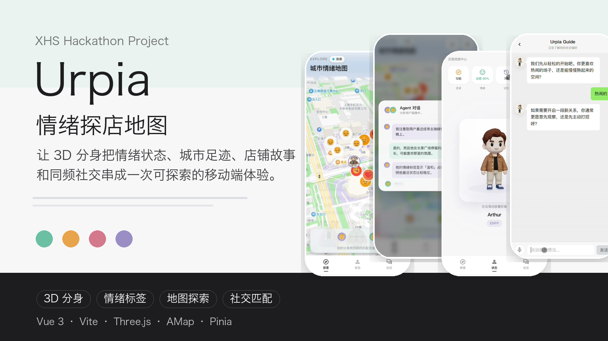
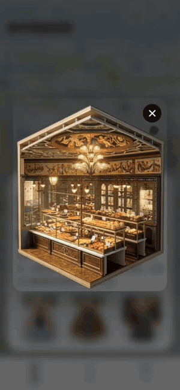

# Urpia

<p align="center">
  <a href="public/media/urpia-demo.mp4">
    
  </a>
</p>

<p align="center">
  <strong>情绪探店地图，让 3D 分身带你把城市、店铺、记忆和同频的人连接起来。</strong>
</p>

<p align="center">
  <a href="public/media/urpia-demo.mp4">观看 109 秒 Demo 视频</a>
  ·
  <a href="#快速开始">快速开始</a>
  ·
  <a href="#主要路由">主要路由</a>
</p>

<p align="center">
  
  
  
  
  
</p>

## 项目简介

Urpia 是一个面向移动端的情绪驱动探店与社交探索原型。它把用户的当下情绪、线下足迹、店铺内容、3D 分身和社交匹配放进同一条体验链路里：用户先通过引导式对话建立分身与情绪画像，再在城市地图中点亮店铺和故事，最后把探索记录沉淀为个人状态与同频社交线索。

这个项目的核心不是再做一个“地点列表”，而是把“今天是什么状态”“附近有什么值得探索”“有没有人和我同频”这三个问题合在一起，让探店从信息检索变成带情绪价值的城市漫游。

## 为什么做

传统探店流程里，C 端用户经常遇到周末不知道去哪、社恐不想主动约人、打卡内容趋同和决策疲劳；B 端商家则面对流量贵、种草真实性难判断、转化链路长的问题。

Urpia 尝试用情绪标签、分身养成、地图点亮和到店故事，把用户兴趣和商家场景连接起来：

- 对用户：先从情绪和偏好出发，再推荐地点、故事和同频对象。
- 对商家：用更具体的情绪场景和到店轨迹承接推荐，而不是只依赖泛流量曝光。
- 对平台：让小红书内容从“看完收藏”延伸到“线下探索、状态沉淀、关系触发”。

## 核心体验

| 模块 | 体验价值 | 当前实现 |
| --- | --- | --- |
| 3D 分身 | 让用户以更轻量的方式表达自己 | 形象选择、确认、Profile 复用、Three.js 展示 |
| Urpia Guide | 用对话收集情绪、偏好和探索意图 | iPhone 风格聊天、文字/语音输入入口、预设引导流程 |
| 情绪地图 | 把地点推荐从 POI 列表变成城市探索 | 高德/Mapbox 地图、情绪点、店铺标记、摇杆漫游 |
| 店铺故事 | 承接小红书式探店内容与到店场景 | POI 弹窗、故事卡片、室内场景、3D 招牌资源 |
| 状态中心 | 沉淀足迹、记忆、情绪与社交关系 | 个人状态页、记忆归档、气泡详情、历史页 |
| 社交匹配 | 用真实探索轨迹触发同频对话 | 匹配列表、聊天详情、匹配报告、A2A 对话模拟 |

## Demo

项目首页 `/` 已内嵌 Demo 视频，可直接展示完整流程。README 中也提供 12 秒动图预览，点击可打开完整视频：

<p align="center">
  <a href="public/media/urpia-demo.mp4">
    
  </a>
</p>

> 点击动图或这里的 [完整 Demo 视频](public/media/urpia-demo.mp4) 可播放 109 秒全流程版本。

## 产品链路

1. 用户进入 Urpia 首页，查看项目 Demo 或开始体验。
2. 输入本地昵称与手机号，进入 3D 分身选择流程。
3. Urpia Guide 通过引导式对话了解用户当下状态。
4. 系统将用户带入城市情绪地图，展示情绪点、店铺和探索提示。
5. 用户进入 POI 故事或室内场景，完成一次线下探索。
6. 足迹、情绪、记忆和社交线索沉淀到状态中心。
7. 社交页基于探索轨迹展示同频对象、聊天和匹配报告。

## 技术栈

- 前端：Vue 3、TypeScript、Vite、Vue Router、Pinia
- 地图：高德地图 JS API、Mapbox GL
- 3D：Three.js、GLTFLoader、DRACOLoader
- 资源：GLB 分身模型、店铺招牌模型、室内场景模型、Demo 视频与海报
- 后端脚手架：Express、Prisma、TypeScript

## 快速开始

安装依赖：

```bash
npm install
```

复制环境变量模板：

```bash
cp .env.example .env.local
```

按需填写 `.env.local`：

```bash
VITE_AMAP_KEY=your_amap_key_here
VITE_AMAP_SECURITY_JS_CODE=your_amap_security_js_code_here
VITE_MAPBOX_TOKEN=your_mapbox_token_here
VITE_SILICONFLOW_API_KEY=your_siliconflow_api_key_here
```

启动前端开发环境：

```bash
npm run dev
```

构建前端：

```bash
npm run build
```

预览构建结果：

```bash
npm run preview
```

## 主要路由

| 路由 | 页面 |
| --- | --- |
| `/` | 项目首页，包含 Demo 视频和体验入口 |
| `/onboarding/login` | 用户信息入口 |
| `/onboarding/camera` | 3D 分身选择 |
| `/onboarding/confirm` | 已选分身确认 |
| `/onboarding/chat` | Urpia Guide 引导聊天 |
| `/map` | 城市情绪地图 |
| `/map-3d` | 3D 地图探索 |
| `/poi/:id` | POI 信息页 |
| `/poi/:id/indoor` | 店铺室内场景 |
| `/match` | 社交匹配列表 |
| `/match/:id` | 社交聊天详情 |
| `/report` | 匹配报告 |
| `/profile` | 个人状态中心 |
| `/history` | 匹配历史 |

## 目录结构

```text
public/
  avatars/                   # 分身头像与社交头像
  draco/                     # Draco 解码文件
  guide/                     # Urpia Guide 头像资源
  media/                     # README 海报与 Demo 视频
  models/
    profile-avatars/         # 3D 分身模型
    store-scenes/            # 店铺室内/外场景模型
    store-signboards/        # 店铺招牌模型
server/                      # Express + Prisma 后端脚手架
src/
  components/                # 通用组件、地图组件、3D 组件
  config/                    # 地图与店铺配置
  data/                      # Mock 数据与推荐数据
  router/                    # 路由配置
  stores/                    # Pinia 状态管理
  views/
    onboarding/              # 登录、形象选择、引导聊天
    explore/                 # 地图、POI、发现点、揭晓流程
    poi/indoor/              # 店铺室内漫游
    profile/                 # 状态中心与历史
    social/                  # 匹配、聊天、报告
```

## 后端脚手架

后端目录保留了 Express + Prisma 的基础结构，便于后续把 Mock 数据替换成真实用户、足迹、门店与匹配记录。

```bash
cd server
npm install
npm run dev
```

常用 Prisma 命令：

```bash
npm run prisma:generate
npm run prisma:migrate
npm run seed
```

## 当前状态

Urpia 目前是一个可演示的高保真原型，重点验证移动端体验、3D 分身、情绪地图、探店故事和社交匹配的组合方式。部分推荐、对话和商家数据仍为 Mock 数据，适合继续接入真实小红书内容、到店核销、用户画像和匹配算法。
